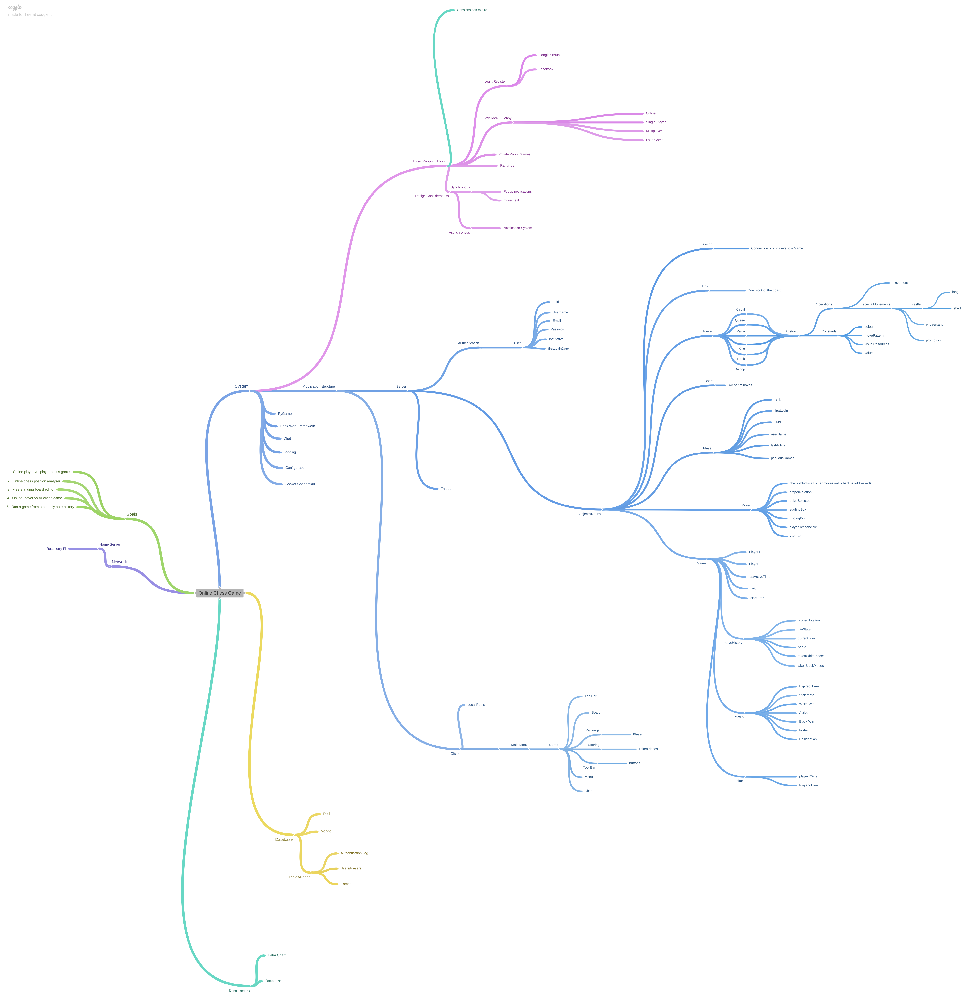

# online_chess_game
Online Chess Game

## Description:
The full project plan as of this time can be found with the below coggle image:

## Development

### Creating a virtual environment
Requirements: Python 3.8+

#### Install pip:
##### Mac and Linux:
`python3 -m pip install --user --upgrade pip`

##### Windows:
`py -m pip install --upgrade pip`
This command for windows actually only checks that there is a pip installed and updates accordingly, windows should come with pip included by default.

#### Install virtualenv:
##### Mac and Linux:
`python3 -m pip install --user virtualenv`

##### Windows:
`py -m pip install --user virtualenv`

#### Setup the environment:
`python3 -m venv /path/to/new/virtual/environment`

I always prefer to use the project name and version with the environment I am creating, for obvious reasons.

#### Activate the environment:
##### Mac and Linux:
`source ./path/to/new/virtual/environment/bin/activate`

##### Windows:
`.\env\Scripts\activate`

This will load/source the environment, so we are working inside the environment with the current terminal

#### Update amd install pip:
`python -m pip install --upgrade pip`

#### Run and install all relevant dependencies, noted in the requirements.txt of the project.
`pip install -r requirements.txt`

##### Adding dependencies and generating a new requirements.txt with pip freeze:
`pip freeze > requirements.txt`

Ensure you have navigated to the correct directory, project root in this case.

#### Leaving the virtual environment:
`deactivate`

##### LICENSE:
This is NOT FOR COMMERCIAL USE. Please contact me and get my permission. 
If you intend to profit from using any of my code please ask my permission.